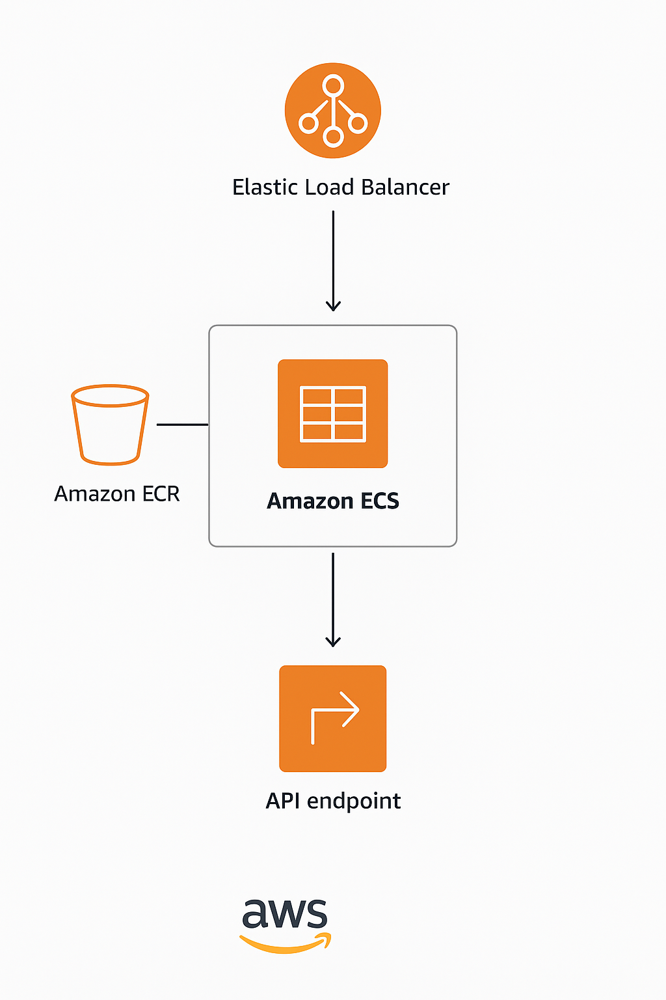

# Book Lending API

A professional-grade **.NET 8 Web API** implementing a clean
architecture, SOLID principles, and production-ready patterns for a
fictional book lending service.

-----------------------------------------------------------------------

# AWS Deployment



------------------------------------------------------------------------

## Features

-   Add, view, check out, and return books.
-   Layered architecture: **Controller → Service → Repository →
    DbContext**
-   Built using **Dependency Injection**, **FluentValidation**, and
    **ProblemDetails**
-   Custom **Exception Middleware**
-   Structured **logging with Serilog**
-   Optional **in-memory caching**
-   Health Checks and Resilience patterns (Polly-ready)
-   Containerized with **Docker**
-   Deployable to **AWS (ECS or Lambda)** using IaC.

------------------------------------------------------------------------

## Architecture Overview

    Controller → Service → Repository → DbContext

-   **Controller Layer:** Handles API requests and responses, performs
    input validation via FluentValidation and ProblemDetails.
-   **Service Layer:** Contains business logic, uses repositories, and
    enforces domain rules.
-   **Repository Layer:** Encapsulates data access logic using Entity
    Framework Core.
-   **Data Layer (DbContext):** Interacts with SQLite or in-memory data
    source.

------------------------------------------------------------------------

## Setup Instructions

### Prerequisites

-   .NET 8 SDK
-   Docker (optional, for containerization)
-   SQLite or in-memory database (default)

### Run Locally

``` bash
git clone https://github.com/vns-arvind/BookLendingService.git
cd BookLending
dotnet restore
dotnet run
```

Visit: <http://localhost:5000/swagger>

------------------------------------------------------------------------

## Design Principles

  Principle             Implementation
  --------------------- -----------------------------------------------------
  **Scalability**       Async APIs, caching, containerization
  **Security**          HTTPS redirection, input validation, error handling
  **Maintainability**   Clean architecture, SOLID principles, DI
  **Resilience**        Exception middleware, retry patterns (Polly-ready)
  **Reliability**       Health checks, structured logging
  **Observability**     Serilog + health probes
  **Testability**       Unit tests, mock repositories

------------------------------------------------------------------------

## API Endpoints

  Method   Endpoint                     Description
  -------- ---------------------------- -------------------------
  `POST`   `/api/books`                 Add a new book
  `GET`    `/api/books`                 Get all available books
  `POST`   `/api/books/{id}/checkout`   Check out a book
  `POST`   `/api/books/{id}/return`     Return a book

------------------------------------------------------------------------

## Option 1 : Docker Setup

### Build Image

``` bash
docker build -t booklending:latest .
```

### Run Container

``` bash
docker run -d -p 8080:80 --name booklending booklending:latest
```
### Now your browser

``` bash
http://localhost:8080/swagger
```

## Option 2 : Run with Docker Compose

### If you’re using Visual Studio, it may generate a Docker Compose setup for you (docker-compose.yml or .dcproj). Run everything via:

``` bash
docker compose up --build
```
------------------------------------------------------------------------

## AWS Deployment (Optional)

### Using ECS (Fargate)

-   Define infrastructure using **AWS CDK (C#)**.
-   Configure environment variables for DB and connection strings.
-   CDK Push Docker image to **Amazon ECR**.
-   Deploy ECS Service with Load Balancer + Auto Scaling.

------------------------------------------------------------------------

## Development Practices

-   **TDD-friendly:** Independent testable components.
-   **Custom Middleware:** Handles global exceptions.
-   **Validation:** FluentValidation integrated at global level.
-   **Logging:** Serilog with console sink (lightweight setup).

------------------------------------------------------------------------

## Example Log Output (Serilog)

    [11:20:15 INF] HTTP POST /api/books responded 201 in 52.4235ms
    [11:20:25 ERR] Book with Id=3 not found in repository.

------------------------------------------------------------------------

## Bonus Enhancements

-   Caching demonstration via IMemoryCache.
-   Optional retry strategy (Polly).
-   Unit testing (xUnit + Moq).
-   Health check endpoint `/health`.

------------------------------------------------------------------------

## Technologies Used

-   .NET 8 Web API
-   Entity Framework Core (SQLite / In-Memory)
-   FluentValidation
-   Serilog (Console Sink)
-   Docker
-   AWS ECS / Lambda Ready
-   xUnit, Moq (for testing)

------------------------------------------------------------------------
